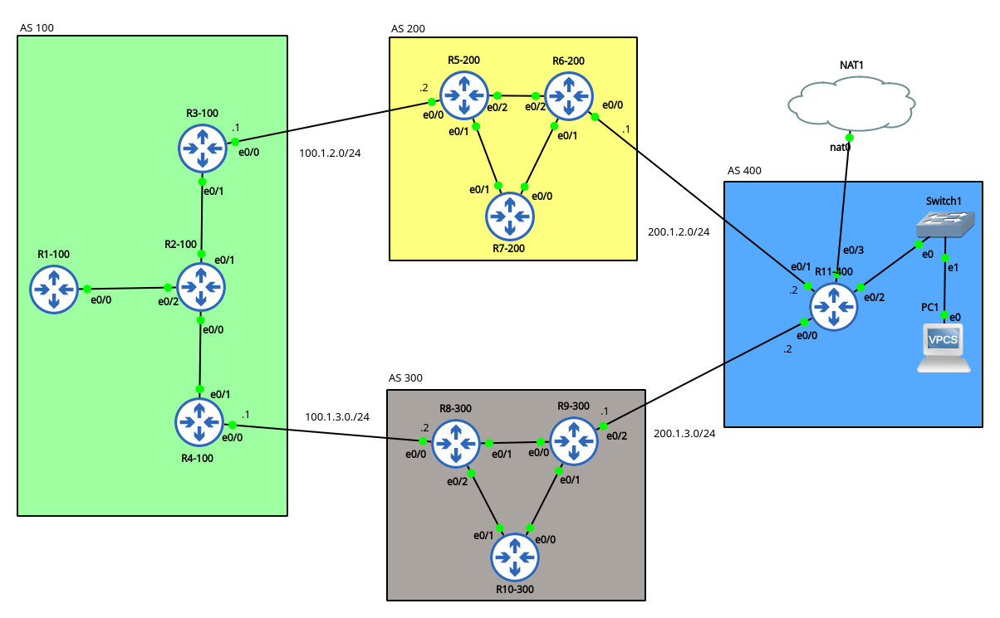

# Statefull_validation_pyATS

## Creating Havoc
  -- interface ethernet 0/2 on R6-200  has been shutdown to demonstrate a network change
  
 ## State Difference found ->
  #pyats diff good1 bad1
  
    --- good1/interface_ios_R6-200_ops.txt
    +++ bad1/interface_ios_R6-200_ops.txt
    info:
     Ethernet0/2:
    -  accounting: 
    -   arp: 
    -    chars_in: 300
    -    chars_out: 300
    -    pkts_in: 5
    -    pkts_out: 5
    -   cdp: 
    -    chars_in: 8382
    -    chars_out: 8382
    -    pkts_in: 22
    -    pkts_out: 22
    -   dec mop: 
    -    chars_in: 154
    -    chars_out: 154
    -    pkts_in: 2
    -    pkts_out: 2
    -   ip: 
    -    chars_in: 15783
    -    chars_out: 15799
    -    pkts_in: 175
    -    pkts_out: 175
    -   other: 
    -    chars_in: 0
    -    chars_out: 6420
    -    pkts_in: 0
    -    pkts_out: 107
    +  enabled: False
    -  enabled: True
    +  oper_status: down
    -  oper_status: up

    --- good1/ospf_ios_R6-200_ops.txt
    +++ bad1/ospf_ios_R6-200_ops.txt
    info:
     vrf:
      default:
       address_family:
        ipv4:
         instance:
          1:
           areas:
            0.0.0.0:
             interfaces:
              Ethernet0/2:
    +           enable: False
    -           enable: True
    -           lls: True
    -           neighbors: 
    -            5.5.5.5: 
    -             address: 192.168.1.1
    -             bdr_ip_addr: 192.168.1.1
    -             dead_timer: 00:00:36
    -             dr_ip_addr: 192.168.1.2
    -             neighbor_router_id: 5.5.5.5
    -             state: full
    -             statistics: 
    -              nbr_event_count: 6
    -              nbr_retrans_qlen: 0
    -           passive: False
    
    
    
    
 # pyATS docs
   https://developer.cisco.com/docs/pyats/
